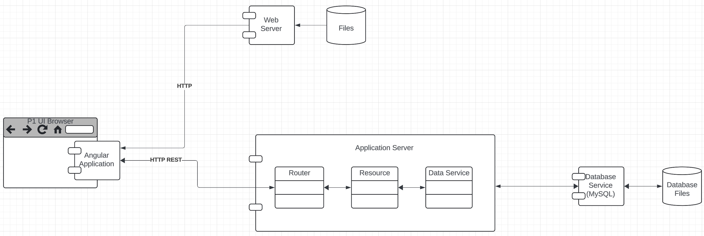
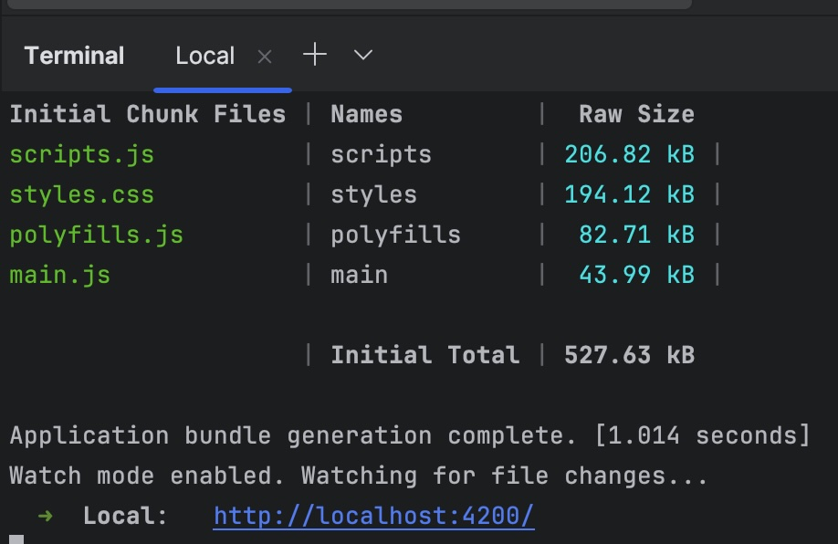
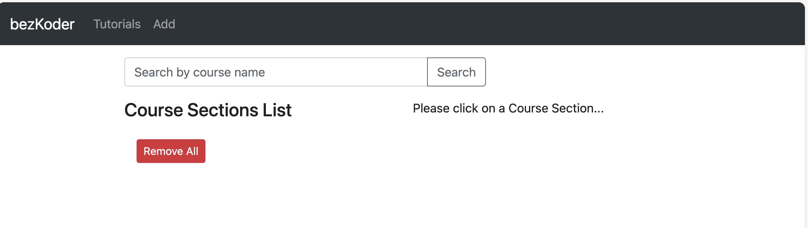

# W4153-P1-UI

GitHub repository for example: https://github.com/donald-f-ferguson/W4153-P1-UI

## Overview

Project 1 in W4153 - Cloud Computing is to build a simple [fullstack web application.](https://medium.com/@p.reaboi.frontend/understanding-full-stack-development-architecture-a-comprehensive-guide-548f8cba6d91)

This project is the user interface (UI) project. It is an Angular application that runs in a browser.

|      |
|:-----------------------------:|
| __Fulltsack Web Application__ |


## Installation

You must [install Angular](https://angular.dev/tools/cli/setup-local) to execute this application.

After installing Angular, open a terminal window. I use WebStore for my integrated development environment (IDE), and
use the terminal window in WebStorm. At the command prompt, enter

```npm install```

This command will run for a while installing application dependencies. You may receive some warning messages. You can
ignore the warnings if the installation is successful. If there are fatal error messages, you must resolve them. How
do you resolve the fatal errors?


You can use Google, Stack Overflow, ChatGT, friends, ... ...

After you have successfully installed the prerequisites, in the terminal command line, enter

```ng serve```

You will see something like



Click on the link ```http://localhost:4200/``` or copy/paste the link in a browser. You will see something like



If you see the browser page, installation worked.

## Running the Application

Before running the application, you must also implement the application and the database projects.


